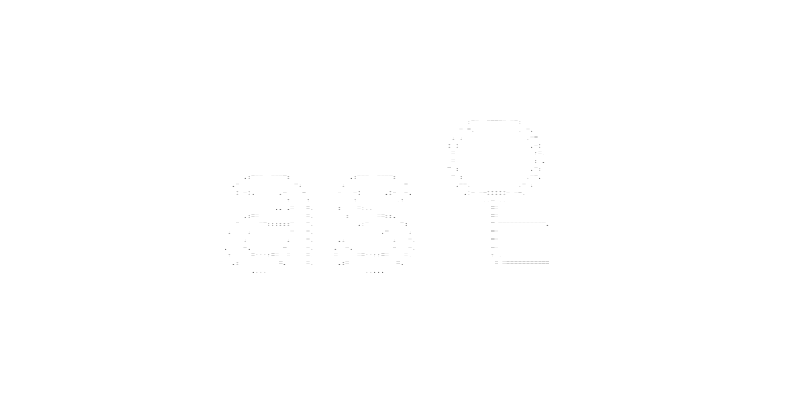
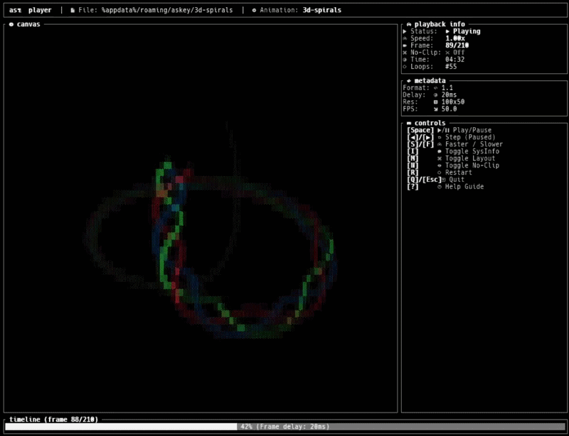

# asꄗ-cli (askey-cli)

<div align="center">
  
</div>

<h6 align="center">
    <a href="https://askey.vercel.app/">Visit Site</a>
    ·
    <a href="https://github.com/kalmix/discussions">Docs</a>
    ·
    <a href="https://github.com/kalmix">Contributing</a>
    ·
    <a href="https://github.com/kalmix/askey-player">askey-player.js</a>
    ·
    <a href="https://github.com/kalmix/askey-cli">askey-cli</a>
</h6>
<div align="center" style="margin-bottom: 1em;">
  
  
  
</div>


`askey-cli` is a terminal player and converter for `.askey` ASCII animations. It features a built-in library browser TUI, interactive drag-and-drop imports, live quantization controls, and dynamic responsive canvas panning in no-clip mode.

<div align="center">
  
</div>

## ƒ Features

- **TUI Library Browser**: Scan, preview, and play animations stored in your local asꄗ folder.
- **Drag & Drop Import Wizard**: Drop `.askey` files or standard images/GIFs directly into the TUI to import/convert on-the-fly.
- **No-Clip Mode & Panning**: Center overflow animations on small terminal screens and pan canvas dynamically with arrow keys.

## Keyboard Controls

### Library Screen
- `[▲/▼]` / `[j/k]` - Navigate list
- `[Enter]` - Play animation
- `[Delete]` - Delete from library
- `[C] / [c]` - Open TUI config modal
- `[?]` - Toggle help dialog

### Player Screen
- `[Space]` - Play / Pause
- `[M] / [m]` - Toggle minimal view / dashboard layout
- `[N] / [n]` - Toggle No-Clip mode
- `[▲/▼/◀/▶]` - Pan canvas (when No-Clip is active) or step frames (when paused)
- `[R] / [r]` - Reset animation speed and canvas panning
- `[+] / [-]` - Adjust speed
- `[Esc]` - Return to library browser

## 🖪 Running the project locally

```bash
# Build optimized release binary
cargo build --release

# Run askey
cargo run
```

### Global Installation (Windows)
```sh
powershell -ExecutionPolicy Bypass -File .\install.ps1
```

## 🛪 CLI Usage

`askey` searches the local directory first, falling back to the AppData library directory.

```bash
# Run askey with no arguments to open the TUI library browser
askey

# Play animation 
askey play test [--noclip] [--dashboard]

# Adds a tiny system fetch panel to the dashboard TUI
askey fetch test

# Convert image/GIF
askey convert my_image.gif --width 80 --preset blocks --quantize 16
```

## ☛ License

This project is licensed under the MIT License - check [LICENSE](LICENSE) for details.
